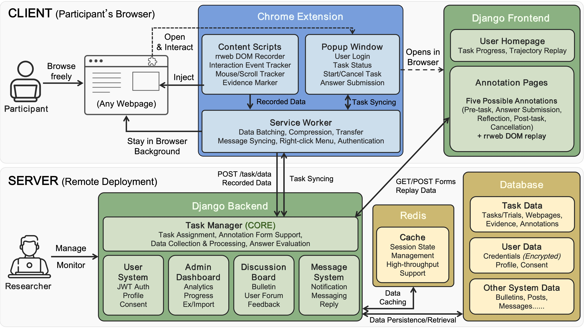
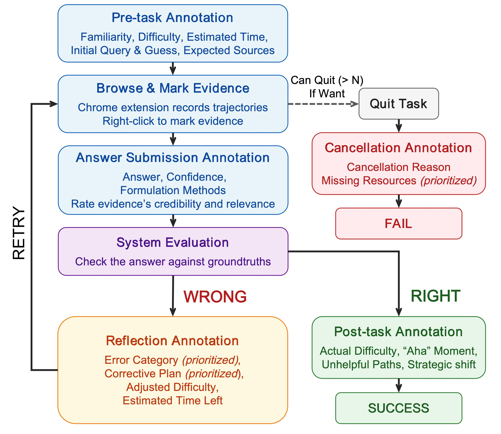

# TEC: A Collection of Human Trial-and-error Trajectories for Problem Solving

> **TEC: A Collection of Human Trial-and-error Trajectories for Problem Solving**
> Xinkai Zhang, Jingtao Zhan, Yiqun Liu, and Qingyao Ai.

Dataset: [Hugging Face](https://huggingface.co/datasets/Serendipity2004/TEC)

## Overview



TEC is an open-source platform for recording, replaying, and annotating user web trajectories. It pairs a Chrome extension with a Django backend to support multi-trial web interaction studies.

- **Chrome Extension** (`ChromeExtension/`): Built on Manifest V3, records three synchronized streams per page — rrweb DOM snapshots, interaction events (clicks, hovers, keypresses), and continuous mouse/scroll positions. Works on any website without per-site configuration.
- **Django Backend** (`Platform/`): Manages the full study lifecycle — task assignment, data ingestion, answer evaluation, replay-based annotation, user authentication, informed consent, admin analytics, and data export/import. Studies are organized hierarchically: dataset → question → per-user task → trials.

## Features

### Trajectory Recording & Replay
- Cross-domain rrweb DOM recording from any webpage
- High-fidelity DOM-based replay with timeline controls
- Mouse trail visualization during replay
- Evidence marking via right-click context menu

### Multi-Stage Annotation Workflow



1. **Pre-task assessment** — familiarity, difficulty, and initial strategy
2. **Browse and collect evidence** — extension records trajectories
3. **Answer submission** — answer with confidence rating and evidence assessments
4. **Correctness evaluation** — automatic evaluation against ground truth
5. **Reflection on failure** — failure diagnosis and corrective plan, then retry

### Platform
- **Task Management**: Create datasets, assign tasks, track progress
- **User System**: Authentication with role-based access, informed consent
- **Admin Dashboard**: Analytics, data visualization, progress monitoring
- **Data Export/Import**: HuggingFace-compatible export (Parquet or JSONL) with anonymization
- **Discussion Forum & Messaging**: Community space and private messaging

## Prerequisites

- Python 3.8+
- Redis
- Google Chrome (for the extension)

## Quick Start

### 1. Setup Environment

```bash
# Using conda (recommended)
conda create --name trajectory_env python=3.10
conda activate trajectory_env
pip install -r requirements.txt

# Or using venv
python -m venv venv
source venv/bin/activate
pip install -r requirements.txt
```

### 2. Configure

```bash
cp Platform/.env.example Platform/.env
# Edit Platform/.env with your settings
```

Key settings in `.env`:
- `DJANGO_SECRET_KEY`: Required for Django
- `DJANGO_DEBUG`: Set to `True` for development (Django dev server), `False` for production (Gunicorn)
- `REMOTE`: Set to `True` to bind to `0.0.0.0:8000` for remote access

### 3. Run

```bash
python Platform/start.py
```

This automatically handles migrations and starts the appropriate server based on your `.env` settings.

For a clean start with sample data (development only):

```bash
python Platform/start.py --clean
```

Visit `http://127.0.0.1:8000/`

### 5. Install Chrome Extension

1. Configure your server address:
   - **`ChromeExtension/config.js`**: For local development, the defaults work out of the box. For remote deployment, set `serverType: 'remote'` and `remoteServerAddress` to your server URL.
   - **`ChromeExtension/manifest.json`**: If using a remote server (e.g. `http://example.com:8000`), add its URL to the following fields:
     ```jsonc
     "host_permissions": [..., "http://example.com:8000/*"],
     "externally_connectable": { "matches": [..., "http://example.com:8000/*"] },
     "content_security_policy": {
       "extension_pages": "script-src 'self'; connect-src http://127.0.0.1:8000 http://localhost:8000 http://example.com:8000;"
     }
     ```
     Also add `"http://example.com:8000/*"` to `exclude_matches` in each `content_scripts` entry and to the `close_helper.js` `matches` array.
2. Navigate to `chrome://extensions`
3. Enable **Developer mode**
4. Click **Load unpacked** and select `ChromeExtension/`

## Usage

1. Log in to the platform and create/start a task
2. The extension automatically records your browsing session
3. Complete the task and end recording via the extension popup
4. Review the DOM-based replay and add annotations (evidence markers, reflections)

## Directory Structure

```
├── ChromeExtension/           # Chrome extension (rrweb-based recording)
├── Platform/             # Django backend
│   ├── task_manager/     # Trajectory and task management
│   ├── user_system/      # Authentication and profiles
│   ├── dashboard/        # Admin analytics
│   ├── discussion/       # Forum system
│   └── msg_system/       # Private messaging
├── requirements.txt
└── README.md
```

## Data Export / Import

The Admin Dashboard provides export and import under the **Export** / **Import** tabs:

- **Export**: Select users and datasets, choose Parquet or JSONL format, toggle anonymization, then download a zip containing the data file, `dataset_info.json`, and `README.md`.
- **Import**: Upload a `.parquet` or `.jsonl` file. The platform auto-detects the format. Supports full (replace all) or incremental (skip duplicates) mode.

Exported zip follows [HuggingFace dataset conventions](https://huggingface.co/docs/datasets/en/repository_structure):

```
export/
├── data/
│   └── train-00000-of-00001.parquet   # or .jsonl
├── dataset_info.json
└── README.md
```

The dataset is published at [Serendipity2004/TEC](https://huggingface.co/datasets/Serendipity2004/TEC) in Parquet format.

## Privacy

- Password inputs are excluded from recording
- Browsing data is only recorded during designated task sessions
- Data export supports anonymization (usernames, emails, ages binned)
- Use incognito mode for session isolation

## Deployment

For production, set `DJANGO_DEBUG=False` in `Platform/.env`, then:

```bash
python Platform/start.py
```

This will collect static files and start Gunicorn automatically.

To run tests:

```bash
python Platform/manage.py test task_manager
```

## Citation

If you use the TEC platform or dataset in your research, please cite:

```bibtex
@article{zhang2026tec,
  title={TEC: A Collection of Human Trial-and-error Trajectories for Problem Solving},
  author={Zhang, Xinkai and Zhan, Jingtao and Liu, Yiqun and Ai, Qingyao},
  year={2026}
}
```

## Contributing

Contributions welcome! Fork the repo, create a feature branch, and submit a pull request.

## License

MIT License - see [LICENSE](./LICENSE)

## Contact

- Email: [stevenzhangx@163.com](mailto:stevenzhangx@163.com)
- GitHub Issues

## Acknowledgements

This platform is built upon the prototype system from the [Web Search Field Study Toolkit](https://github.com/xuanyuan14/Web-Search-Field-Study-Toolkit). We thank the authors for their foundational contribution.
